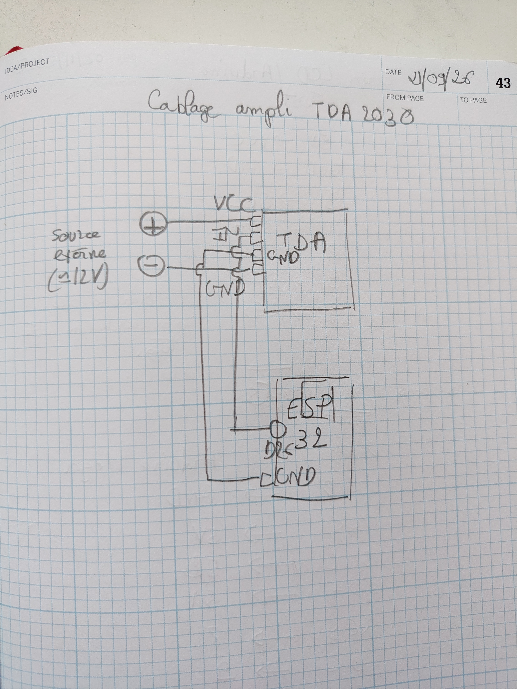
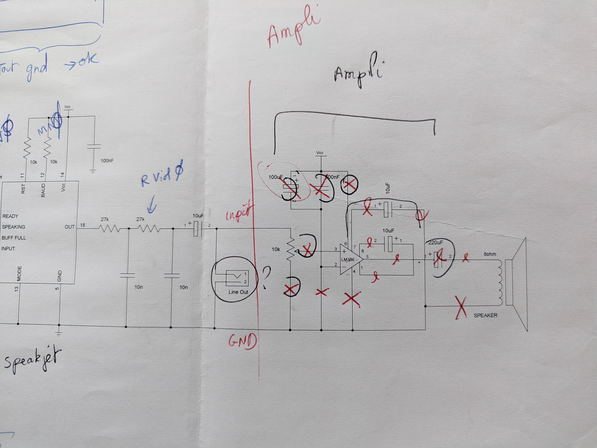

# Chladni
Utiliser des micro-controleurs pour faire des figures de Chladni

Plusieurs phases : 
1. Générer et contrôler du son avec un Arduino (puis ESP32, puis microchip (mais je ne promets rien))
2. Afficher des infos sur chacun des modèles avec un écran LCD. 

#Générer et contrôler du son avec un Arduino
Je voudrais bien générer un son plus fort que ce que peut sortir l'arduino, mais pour ça faut amplifier, et faire un circuit avec un transistor
et ça, j'ai pas directement sous la main. En fait peut-être que si. 

Je voulais aussi  utiliser la bibliothèque [toneAC](https://github.com/jurs/toneAC) qui promet un volume double de ce que produirait un 
arduino normale. Mais le fichier [toneAC_Demo](./toneAC_demo.pde) retourne plein d'erreur .. à voir.

Samedi 19 septembre. On reprend le problème(?) de l'amplification. Je me base sur [ce tuto](https://passionelectronique.fr/haut-parleur-arduino/  )

Schema : 

D'abord, un modèle sans amplification le fichier [happybirthday](./happybirthday/happybirthday.ino). Le son est trop bas pour faire vibrer une membrane.

Et puis avec l'ampli du tuto cité plus haut. On entends, mais c'est toujours pas assez fort pour faire vibrer une membrane. Voir photos et vidéos, j'ai un peu simplifié le schéma, mais ça ne change pas grand chose. Je n'avais pas le bon Mosfet, j'ai utilisé un BUK553, c'est tout ce que j'avais. 

En même temps, j'ai cramé l'arduino, je continue avec un esp32. 
J'ai acheté des amplis tout fait TDA2030 et une alimentation réglable, et ça a fini par marché. 
Le cablage est ici : 

Il y a aussi les programmes qui font des sons. 

Je me suis aussi rappelé que j'avais construit un ampli pour un speakjet (un circuit de synthèse vocale) : 
 

Si je retrouve mes LM386, je vais essayer de le refaire. 

26/09
En utilisant ce tuto : https://www.youtube.com/watch?v=hKmPc0Q0kKg

J'ai refait un truc en collant une tige filetée sur la membrane du haut-parleur. 
J'ai ensuite coupé la tige filetée (quand c'est trop lourd, la membrane a du mal à commmuniquer sa vibration.)
Il y a plein de photos et de vidéos dans le git, mais c'est tout en bazar. 
Sur la tige filetée, avec deux vis, on peut fixer une plaque vibrante. 
Là ça commence à marcher. 
Le choix du matériau et des dimensions de la plaque doit avoir de l'importance -> à tester...

J'ai rajouté un potentiomètre pour pouvoir changer la fréquence, mais il faut que je raffine le système. 
On ne doit pas changer le son à chaque mouvement du potentiomètre, je vais utiliser les interruptions, et ne faire un changement
que lorsque la nouvelle valeur est significativement différente de la précédente. 

Pour les interr

