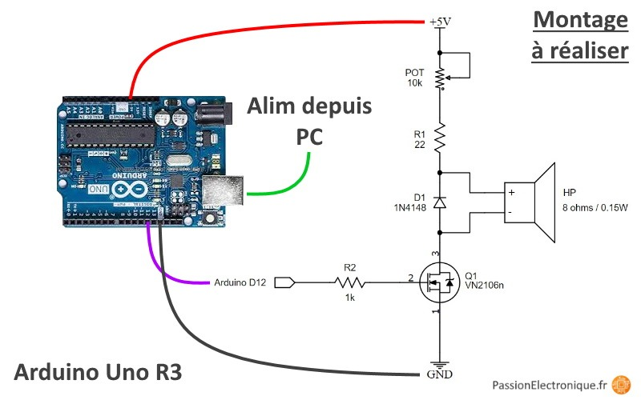

# Chladni
Utiliser des micro-controleurs pour faire des figures de Chladni

Plusieurs phases : 
1. Générer et contrôler du son avec un Arduino (puis ESP32, puis microchip (mais je ne promets rien))
2. Afficher des infos sur chacun des modèles avec un écran LCD. 

#Générer et contrôler du son avec un Arduino
Je voudrais bien générer un son plus fort que ce que peut sortir l'arduino, mais pour ça faut amplifier, et faire un circuit avec un transistor
et ça, j'ai pas directement sous la main. En fait peut-être que si. 

Je voulais aussi  utiliser la bibliothèque [toneAC](https://github.com/jurs/toneAC) qui promet un volume double de ce que produirait un 
arduino normale. Mais le fichier [toneAC_Demo](./toneAC_demo.pde) retourne plein d'erreur .. à voir.

Samedi 19 septembre. On reprend le problème(?) de l'amplification. Je me base sur [ce tuto](https://passionelectronique.fr/haut-parleur-arduino/  )

Schema : 

D'abord, un modèle sans amplification le fichier[HappyBirthday](./happybirthday/happybirthday.ino). Le son est trop bas pour faire vibrer une membrane.

